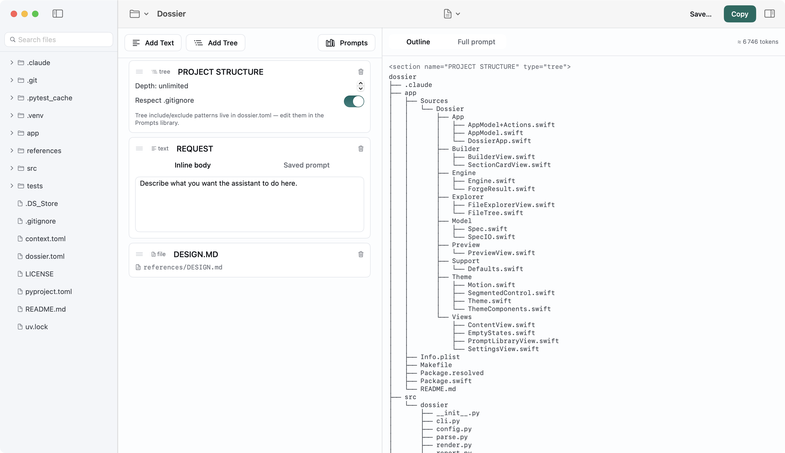

# Dossier

**A native macOS app for building deliberate, reproducible AI context from your
codebase** — backed by a small, scriptable CLI engine.

Dossier turns pieces of a local repository — a file tree, the full text of
specific files, and your own instructions — into one structured prompt you can
hand to an AI assistant (Claude, ChatGPT, and the like) without reassembling it
by hand every time. You describe the prompt once in a declarative `context.toml`;
Dossier reads the *current* state of the repo and renders it, so the context you
send is never quietly out of date.



There are two ways to use it, over one shared spec:

- **The app** (macOS) — a three-pane editor that makes assembling and
  maintaining a spec pleasant: pick files from a live tree, arrange sections,
  edit instructions, and watch the rendered prompt and token count update as you
  go, then copy or save the result.
- **The engine** (CLI) — the same rendering as a small command you can script,
  pipe, and run in CI. The app never renders prompts itself; it edits the spec
  and shells out to the engine. **There is one source of truth for output.**

---

## The app

A single window, three panes — explorer · builder · preview:

- **File explorer** — a live, IDE-style tree of the project. Add a file to the
  prompt with `+` or by dragging it onto the builder; remove it with `−`.
  Included files are marked.
- **Prompt builder** — the spec's sections as editable cards in render order.
  Add `text` and `tree` sections, edit every type inline, drag to reorder, and
  delete. Everything autosaves to the `context.toml`.
- **Live preview** — a structural outline of the prompt as you build it (file
  bodies collapsed to a summary), a token estimate, and a **Show full prompt**
  toggle that reveals the exact text **Copy** and **Save** emit. Spec errors
  (a missing file, an unknown prompt) show inline, named by section.

Plus: a prompt library and tree-filter editor (`dossier.toml`), multiple specs
per folder, light/dark themes, and a Settings window for the engine path and
preferences.

### Requirements

- macOS 14 (Sonoma) or newer.
- The `dossier` CLI on your `PATH` (see [Installation](#installing-the-engine)).
  The app auto-detects it and offers a manual override in Settings.

### Install (Apple Silicon)

One command installs both the `dossier` CLI and `Dossier.app`:

```sh
curl -fsSL https://raw.githubusercontent.com/Jad1908/dossier/main/install.sh | sh
```

It installs the CLI via [uv](https://docs.astral.sh/uv/), downloads the app from
the latest release, clears the download quarantine (the build is ad-hoc signed,
not notarized), and moves it to `/Applications`. On Intel, build from source
(below).

### Build & run from source

The app is a Swift package under [`app/`](app/) (it builds with the Swift
toolchain alone — no full Xcode required):

```bash
cd app
make run        # builds release + assembles and opens Dossier.app
```

See [`app/README.md`](app/README.md) for the architecture, build phases, and the
engine ↔ app JSON contract.

### Cutting a release

Pushing a version tag builds the app on CI and publishes the installer's assets:

```bash
git tag v1.0.0 && git push origin v1.0.0
```

The [release workflow](.github/workflows/release.yml) runs `make release`
(zip + checksum) on an Apple-Silicon runner and attaches them to the GitHub
Release. Locally, `cd app && make release` produces the same `Dossier.zip` +
`Dossier.zip.sha256`.

---

## The engine (CLI)

The same selection-and-rendering logic as a transparent command. The output is
plain text you can read, diff, and commit.

```bash
# In any project:
cd ~/code/myapp
dossier init        # writes a starter context.toml
$EDITOR context.toml
dossier forge       # renders the prompt and copies it to your clipboard
```

A `context.toml` like this:

```toml
[[section]]
type = "tree"
title = "PROJECT STRUCTURE"

[[section]]
type = "file"
title = "AUTH MODULE"
path = "src/app/auth.py"

[[section]]
type = "text"
title = "REQUEST"
body = "Add rate limiting to the login endpoint. Keep the existing API shape."
```

produces:

```
<section name="PROJECT STRUCTURE" type="tree">
myapp
├── src
│   └── app
│       ├── auth.py
│       └── main.py
└── pyproject.toml
</section>

<section name="AUTH MODULE" type="file">
def login(username, password):
    ...
</section>

<section name="REQUEST" type="text">
Add rate limiting to the login endpoint. Keep the existing API shape.
</section>
```

### Installing the engine

The engine requires Python 3.11+ and [uv](https://docs.astral.sh/uv/). Install it
once, globally — the app uses this same binary:

```bash
# Straight from GitHub:
uv tool install "git+https://github.com/Jad1908/dossier.git"

# Or from a local clone (use --editable to track your changes):
uv tool install --editable /path/to/dossier
```

`dossier` is then available from any directory (run `uv tool update-shell` once
if the command isn't found). Upgrade or remove with `uv tool upgrade dossier` /
`uv tool uninstall dossier`. To run without installing:

```bash
uvx --from /path/to/dossier dossier forge --root ~/code/myapp
```

---

## The spec file

Both the app and the CLI read the same spec — a TOML file (`context.toml` by
default) at the root of the project you are describing. Every path inside it is
relative to that root, and sections render in the order listed.

```toml
[[section]]
type = "tree"
title = "PROJECT STRUCTURE"
max_depth = -1         # -1 = unlimited; 0 = root only; N = descend N levels
use_gitignore = true   # also skip anything in the repo's root .gitignore

[[section]]
type = "file"
title = "COLUMN NAMES SCHEMA"
path = "src/schemas/column_names.py"

[[section]]
type = "text"
title = "REQUEST"
body = "Define a feature_names.py schema and update the training config to use it."
```

### Section types

| Type   | Required                              | What it does                                                                                                   |
|--------|---------------------------------------|----------------------------------------------------------------------------------------------------------------|
| `text` | `title`, and one of `body` / `prompt` | Inserts text. Use `body` for inline text, or `prompt` to pull a reusable prompt from your config by name.       |
| `file` | `title`, `path`                       | Reads the file at `path` and inlines its text. The whole file is included; `path` is a source to read, not an attachment. |
| `tree` | `title`                               | Renders an ASCII tree of the repository. Optional `max_depth` and `use_gitignore`.                              |

The tree always skips noise directories regardless of settings: `.git`,
`__pycache__`, `.venv`, `venv`, `node_modules`, `.mypy_cache`, `.pytest_cache`,
`.ruff_cache`, `.idea`, `.vscode`, `dist`, `build`, and `.DS_Store`. With
`use_gitignore = true` (the default) it also honours the repository's root
`.gitignore`.

### Writing prompts inline or storing them

A `text` section takes exactly one of `body` or `prompt`:

- `body` puts the text directly in the spec. Best for one-off, spec-specific
  instructions. No config file is needed.
- `prompt` names an entry in the `[prompts]` table of your `dossier.toml`. Best
  for instructions you reuse across specs and projects. (The app's Prompt
  Library edits this table.)

### Multiple specs in one folder

`init` and `forge` (and the app's spec switcher) take an optional name so you can
keep several specs side by side. A name maps to `context.<name>.toml`; with no
name, the default `context.toml` is used.

```bash
dossier init auth     # writes context.auth.toml
dossier forge auth    # forges from context.auth.toml
```

## Project configuration

An optional `dossier.toml` at the project root holds defaults shared across the
spec files in that folder. Every block is optional.

```toml
# Default output behaviour. A spec's own [output] overrides this; CLI flags
# override both.
[output]
copy = true            # copy the forged prompt to the clipboard
stdout = true          # also print it to stdout
file = ""              # if set, write it to this path

# Tree filters applied to every tree section. `exclude` adds skip patterns;
# `include` forces entries back in even when default skips or .gitignore would
# drop them. Patterns are globs, matched against each entry's name and path.
[tree]
exclude = ["docs", "*.snap"]
include = ["dist"]

# Reusable prompts, referenced from a text section by name.
[prompts]
refactor = "Refactor the code above for readability. Keep behaviour identical."
explain  = "Explain what the code above does, step by step, and flag any bugs."
```

**Precedence** — Output settings: CLI flags → spec `[output]` → config
`[output]` → built-in defaults. Tree filters: config `[tree]` and the CLI
`--include` / `--exclude` are combined, and `include` wins over `exclude`,
default skips, and `.gitignore`.

## Command reference

Both commands accept `--root PATH` (project root, defaults to the cwd) and
`--spec PATH` (explicit spec path, overrides the positional name).

### `dossier init [NAME]`

Writes a starter spec (`context.toml`, or `context.<name>.toml`). It will not
overwrite an existing spec.

### `dossier forge [NAME]`

Renders the prompt from the spec. Additional options:

| Option                     | Description                                                |
|----------------------------|------------------------------------------------------------|
| `--config PATH`            | Config file. Defaults to `<root>/dossier.toml`.            |
| `--include` / `--exclude`  | Force a glob into / out of the tree. Repeatable.           |
| `--copy` / `--no-copy`     | Copy the prompt to the clipboard.                          |
| `--stdout` / `--no-stdout` | Print the prompt to stdout.                                |
| `--out PATH`               | Write the prompt to a file.                                |
| `--format text \| json`    | `json` emits a machine-readable result (no side effects) — the mode the app consumes. |

A token estimate (`tiktoken`'s `o200k_base`) is printed to stderr, so stdout
stays clean for piping. `forge` exits non-zero, with no output, on a validation
error, a missing `file` path, or an unknown `prompt` reference — except in
`--format json`, which reports those inside the JSON and still exits `0`.

## Output format

Each section is wrapped in a labelled envelope, sections separated by a blank
line:

```
<section name="{TITLE}" type="{TYPE}">
{CONTENT}
</section>
```

The format is round-trippable: a rendered prompt can be parsed back into
`(name, type, content)` records, keeping the output machine-readable for tooling.

## Architecture

A monorepo: the Python engine at the root, the macOS app nested in [`app/`](app/).
They are coupled by the `dossier forge --format json` contract, so a change to it
lands on both sides in one commit. A contract test
(`tests/test_forge_json.py`) asserts the JSON shape the app's data model expects.

- **The engine owns rendering, tree-walking, and token counting.** None of it is
  duplicated in Swift.
- **The app owns the spec files and the editing experience.** It reads and writes
  `context.toml` / `dossier.toml`, and produces every preview by invoking the
  engine as a subprocess.

## Design notes and limitations

- **Whole files only.** A `file` section includes the entire file; there is no
  line-range or symbol-level extraction.
- **Single tokenizer.** Counts use `o200k_base` and are approximate.
- **App-managed specs lose comments.** When the app rewrites a spec it
  reserializes the TOML, dropping hand-written comments (the CLI never rewrites
  your spec).
- **Literal `</section>` lines.** If a source file contains a line that is
  exactly `</section>`, the round-trip parser will mis-split that section.

## Development

```bash
uv sync && uv run pytest          # the engine
cd app && swift build             # the app
```

The engine keeps I/O at the edges and the rendering/parsing/tree logic pure, so
most behaviour is covered by fast unit tests. Issues and pull requests welcome.
