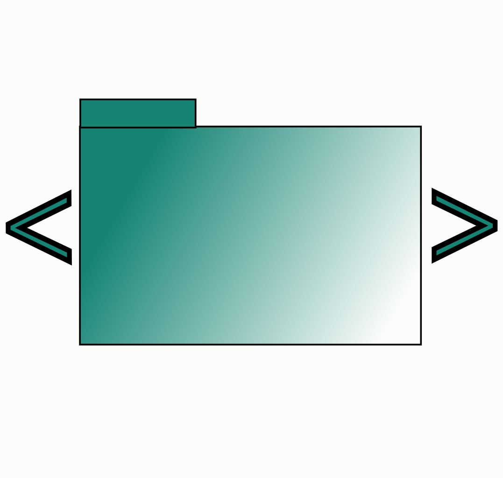

<div align="center">



# Dossier

**Give your AI the right context — every time.**

A native macOS app for assembling your codebase into one clean, deliberate
prompt. Pick the files that matter, add your ask, and hand the AI a context
it can actually reason about.


</div>

---

## Why Dossier

Pasting files into a chat is lossy. You forget a file, you include a stale one,
you lose track of what the model actually saw. Dossier makes the context an
artifact you can see, shape, and trust.

- **🌲 Show, don't dump.** A live file tree of your project. Add what's
  relevant with a click, leave the noise out.
- **🎯 Deliberate by design.** Arrange files, instructions, and structure as
  ordered sections. The prompt reads the way you intend it to.
- **🔄 Always current.** Your context describes *what* to include, not a frozen
  copy. Reopen it tomorrow and it reflects today's code — never quietly stale.
- **👀 See exactly what you send.** A live preview and token count update as you
  build. No surprises about what reaches the model.
- **📚 Reuse the good stuff.** Save your sharpest instructions to a library and
  drop them into any project.

Built for Claude, ChatGPT, and any assistant that takes a prompt.

---

## The window

One window, three panes — **explorer · builder · preview**:

- **File explorer** — a live, IDE-style tree of your project. Click to add a
  file, click to remove it.
- **Prompt builder** — your context as editable cards. Add instructions and
  structure, drag to reorder, edit inline. It saves as you go.
- **Live preview** — the assembled prompt, a running token estimate, and a
  full-text view of exactly what **Copy** and **Save** will hand off.

Plus a prompt library, light/dark themes, and multiple contexts per project.

---

## Install

Apple Silicon, one command:

```sh
curl -fsSL https://raw.githubusercontent.com/Jad1908/dossier/main/install.sh | sh
```

Requires macOS 14 (Sonoma) or newer. On Intel, build from source — see
[`app/README.md`](app/README.md).

---

## License

[MIT](LICENSE). Issues and pull requests welcome.
